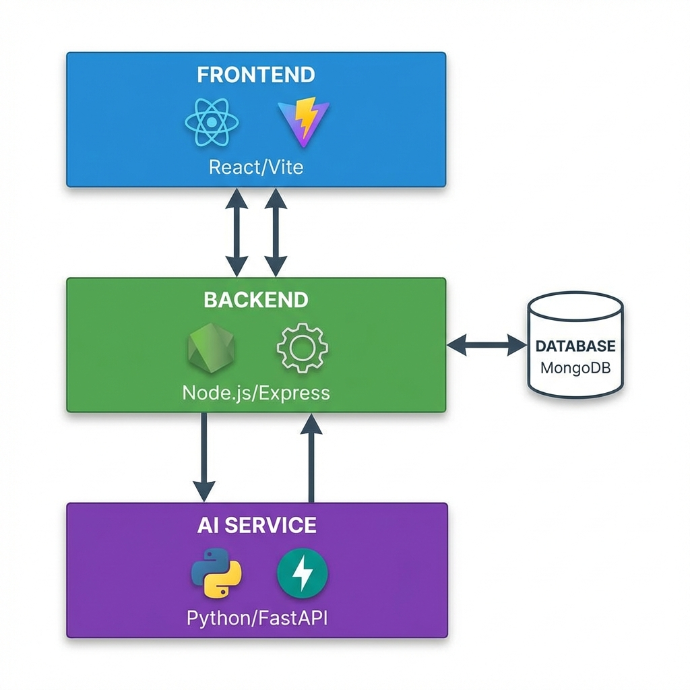
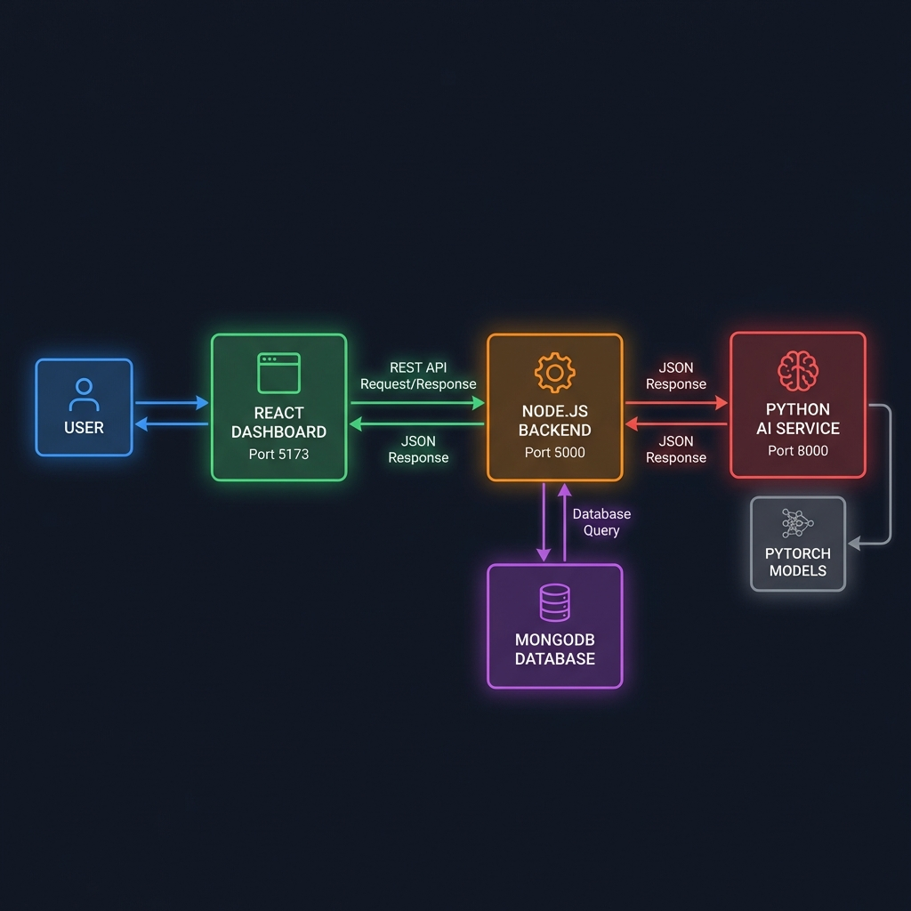
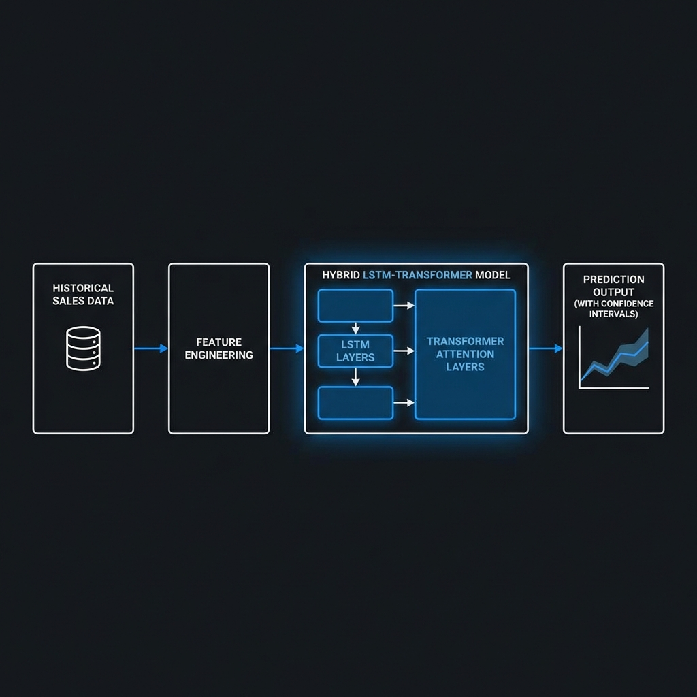
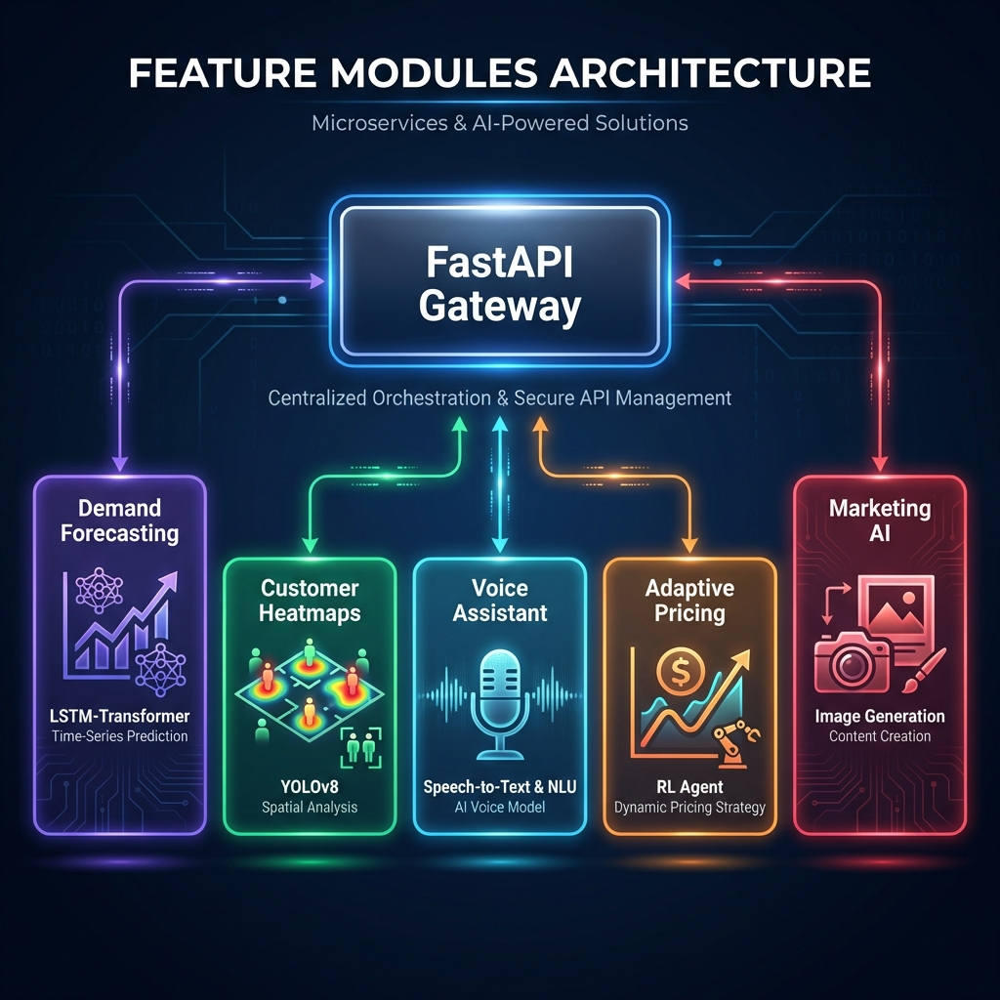

# MSME Platform - Complete Workflow & Architecture Documentation

**Advanced AI-Powered Business Intelligence Platform**

---

## 📑 Table of Contents

1. [System Architecture](#1-system-architecture)
2. [Technology Stack](#2-technology-stack)
3. [Complete System Workflow](#3-complete-system-workflow)
4. [AI/ML Pipeline Architecture](#4-aiml-pipeline-architecture)
5. [Feature Modules](#5-feature-modules)
6. [Detailed Workflows](#6-detailed-workflows)
7. [Data Flow Diagrams](#7-data-flow-diagrams)
8. [API Integration](#8-api-integration)

---

## 1. System Architecture 🏗️

The system follows a **Microservices-inspired Architecture** where the Backend serves as the central hub, orchestrating data between the Client, Database, and the AI Engine.



### Architecture Layers:

#### **Frontend Layer (Blue)**
- **Technology:** React 18 + Vite
- **Port:** 5173
- **Purpose:** User interface and visualization
- **Components:**
  - Dashboard with real-time P&L trends
  - Inventory management interface
  - AI feature interfaces (Forecasting, Heatmaps, Voice)
  - Marketing automation tools

#### **Backend Layer (Green)**
- **Technology:** Node.js + Express
- **Port:** 5000
- **Purpose:** Business logic and API orchestration
- **Responsibilities:**
  - REST API endpoints
  - Request validation
  - Database operations
  - AI service coordination
  - Authentication & authorization

#### **AI Service Layer (Purple)**
- **Technology:** Python + FastAPI
- **Port:** 8000
- **Purpose:** Machine learning and AI processing
- **Capabilities:**
  - Demand forecasting
  - Computer vision
  - Natural language processing
  - Reinforcement learning

#### **Database Layer**
- **Technology:** MongoDB
- **Purpose:** Data persistence
- **Collections:**
  - Products
  - Transactions
  - Users
  - Inventory
  - Analytics

---

## 2. Technology Stack 💻

### Frontend Technologies
| Technology | Version | Purpose |
|------------|---------|---------|
| **React** | 18+ | UI framework |
| **Vite** | 5+ | Build tool & dev server |
| **CSS3** | - | Styling with animations |
| **Axios** | Latest | HTTP client |

### Backend Technologies
| Technology | Version | Purpose |
|------------|---------|---------|
| **Node.js** | 18+ | Runtime environment |
| **Express** | 4+ | Web framework |
| **MongoDB** | 6+ | NoSQL database |
| **Mongoose** | 8+ | ODM for MongoDB |
| **JWT** | Latest | Authentication |

### AI/ML Technologies
| Technology | Version | Purpose |
|------------|---------|---------|
| **Python** | 3.11+ | Programming language |
| **FastAPI** | 0.128+ | Web framework |
| **PyTorch** | 2.9+ | Deep learning |
| **Transformers** | Latest | NLP models |
| **YOLOv8** | Latest | Object detection |
| **NumPy** | 2.4+ | Numerical computing |
| **Pandas** | 2.3+ | Data manipulation |

---

## 3. Complete System Workflow 🔄



### Request-Response Flow:

#### **Step 1: User Interaction**
- User opens browser and navigates to `http://localhost:5173`
- React Dashboard loads with modern UI
- User interacts with features (e.g., clicks "Demand Forecasting")

#### **Step 2: API Request**
- React component makes REST API call
- Request format: `POST /api/forecast/forecast`
- Headers include authentication token
- Body contains product data and historical sales

#### **Step 3: Backend Processing**
- Node.js Backend receives request on port 5000
- Validates request payload
- Checks user authentication
- Queries MongoDB for additional data if needed

#### **Step 4: AI Service Call**
- Backend forwards request to AI Service (port 8000)
- Uses internal HTTP client
- Includes necessary context and data

#### **Step 5: AI Processing**
- FastAPI receives request
- Loads appropriate ML model (PyTorch)
- Preprocesses input data
- Runs inference
- Generates predictions with confidence intervals

#### **Step 6: Response Formation**
- AI Service formats response as JSON
- Returns to Backend
- Backend adds business logic
- Formats final response

#### **Step 7: Dashboard Update**
- Frontend receives JSON response
- React components update state
- UI re-renders with new data
- Charts and visualizations update

---

## 4. AI/ML Pipeline Architecture 🤖



### Hybrid LSTM-Transformer Pipeline:

#### **Stage 1: Historical Sales Data**
- **Input:** 60 days of sales history
- **Format:** Time series array
- **Example:** `[100, 105, 98, 110, ...]`

#### **Stage 2: Feature Engineering**
- **Temporal Features:**
  - Day of week (0-6)
  - Day of month (1-31)
  - Month (1-12)
  - Trend indicators
- **Cyclic Encoding:**
  - Sine/cosine transformations for periodicity
  - `sin(2π * day_of_week / 7)`
  - `cos(2π * month / 12)`
- **Normalization:**
  - Min-max scaling
  - `(value - min) / (max - min)`
- **Output:** 10-feature matrix (60 timesteps × 10 features)

#### **Stage 3: Hybrid LSTM-Transformer Model**

**LSTM Layers:**
- **Purpose:** Capture sequential patterns
- **Architecture:**
  - 2 LSTM layers
  - Hidden size: 128
  - Bidirectional: Yes
  - Dropout: 0.2
- **Output:** Sequential embeddings

**Transformer Attention Layers:**
- **Purpose:** Capture long-range dependencies
- **Architecture:**
  - 2 Transformer encoder layers
  - Dimension: 256
  - Attention heads: 4
  - Feedforward dim: 512
- **Mechanism:** Multi-head self-attention
- **Output:** Contextualized representations

**Model Parameters:**
- Total: ~1.2 million trainable parameters
- Training time: 20-30 minutes on M2 GPU
- Inference time: 20-50ms per prediction

#### **Stage 4: Prediction Output**
- **7-Day Forecast:** Next week predictions
- **30-Day Forecast:** Next month predictions
- **Confidence Intervals:** ±1 standard deviation
- **Format:**
  ```json
  {
    "forecast_7day": [105, 108, 102, ...],
    "confidence_7day_lower": [95, 98, 92, ...],
    "confidence_7day_upper": [115, 118, 112, ...]
  }
  ```

---

## 5. Feature Modules 🎯



### Central FastAPI Gateway
- **Purpose:** Centralized orchestration & secure API management
- **Responsibilities:**
  - Route requests to appropriate modules
  - Handle authentication
  - Rate limiting
  - Response formatting

### Module 1: Demand Forecasting 📈
**Technology:** LSTM-Transformer  
**Purpose:** Time-series prediction

**Features:**
- 7-day and 30-day forecasts
- Confidence intervals
- Trend analysis
- Seasonality detection

**Workflow:**
1. Receive historical sales (60 days)
2. Feature engineering
3. Model inference
4. Return predictions with uncertainty

**API Endpoint:** `POST /api/forecast/forecast`

---

### Module 2: Customer Heatmaps 🗺️
**Technology:** YOLOv8 + Spatial Analysis  
**Purpose:** Foot traffic analysis

**Features:**
- Person detection in store images
- Heatmap generation
- High-traffic zone identification
- Temporal patterns

**Workflow:**
1. Upload store camera image
2. YOLOv8 detects persons
3. Generate spatial density map
4. Create visual heatmap overlay
5. Identify optimization opportunities

**API Endpoint:** `POST /analytics/customer-heatmap`

---

### Module 3: Voice Assistant 🎤
**Technology:** Speech-to-Text + NLU  
**Purpose:** Multilingual voice queries

**Features:**
- 100+ language support
- Auto language detection
- Natural language understanding
- Inventory queries

**Workflow:**
1. Record voice input (browser MediaRecorder)
2. Send audio to AI service
3. Transcribe using Whisper (if installed)
4. Parse intent and entities
5. Query inventory database
6. Generate natural language response

**API Endpoint:** `POST /inventory/voice-query`

**Supported Queries:**
- "What's the stock of Product X?"
- "Show low stock items"
- "Which products expire soon?"

---

### Module 4: Adaptive Pricing 💰
**Technology:** RL Agent (Q-Learning)  
**Purpose:** Dynamic pricing strategy

**Features:**
- Online learning from sales
- Multi-strategy ensemble
- Stock-aware pricing
- Competitor tracking

**Workflow:**
1. Receive product state (stock, expiry, competitor price)
2. RL agent evaluates strategies
3. Calculate optimal price multiplier
4. Return pricing recommendation
5. Learn from actual sales (feedback loop)

**API Endpoints:**
- `POST /pricing/adaptive` - Get price recommendation
- `POST /pricing/feedback` - Record sales outcome

**Strategies:**
- Clearance pricing (low stock)
- Premium pricing (high demand)
- Competitive pricing (market-based)
- Dynamic discounting

---

### Module 5: Marketing AI 🎨
**Technology:** Image Generation + Content Optimization  
**Purpose:** Automated marketing content

**Features:**
- AI poster generation
- Marketing copy optimization
- Multilingual support
- Discount optimization

**Workflow:**
1. User provides product info
2. AI generates visual prompt
3. Create poster using Stable Diffusion API
4. Optimize discount using RL
5. Generate marketing copy
6. Return complete campaign materials

**API Endpoints:**
- `POST /marketing/generate-poster`
- `POST /marketing/optimize-copy`
- `POST /marketing/voice-poster` (voice-driven)

---

## 6. Detailed Workflows 📋

### A. Inventory & Sales Loop (The Core Engine)

#### **Stock Entry:**
- User adds products via "Inventory" page
- Data saved to `products` collection
- Fields: name, category, price, stock, expiry

#### **Point of Sale:**
- User sells items via "Sell" or "Bulk Sell"
- **Action:** Stock decreases
- **Trigger 1:** Financial transaction (Income) auto-created
- **Trigger 2:** Real-time demand sync - product's history array updated with sales volume

#### **Restocking:**
- User adds stock
- **Trigger:** Transaction (Expense) auto-created with category: 'Inventory Restocking'

---

### B. Demand Forecasting Workflow

#### **Step 1: Data Collection**
```javascript
// Frontend collects historical data
const historicalSales = product.salesHistory.slice(-60); // Last 60 days
```

#### **Step 2: API Request**
```javascript
const response = await axios.post('http://localhost:8000/api/forecast/forecast', {
  product_id: product.id,
  product_name: product.name,
  historical_sales: historicalSales
});
```

#### **Step 3: Backend Processing**
```python
# AI Service receives request
@router.post("/forecast")
async def generate_forecast(request: ForecastRequest):
    # Load model
    model, device = load_model()
    
    # Preprocess
    input_tensor = preprocess_input(request.historical_sales)
    
    # Inference
    forecast_7day, forecast_30day = model.predict(input_tensor)
    
    return ForecastResponse(...)
```

#### **Step 4: Model Inference**
```python
# Hybrid model forward pass
def forward(self, x):
    # LSTM processing
    lstm_out, _ = self.lstm(x)
    
    # Transformer processing
    transformer_out = self.transformer(lstm_out)
    
    # Predictions
    forecast_7 = self.fc_7day(transformer_out)
    forecast_30 = self.fc_30day(transformer_out)
    
    return forecast_7, forecast_30
```

#### **Step 5: Response Handling**
```javascript
// Frontend displays results
setForecast({
  sevenDay: response.data.forecast_7day,
  thirtyDay: response.data.forecast_30day,
  confidence: response.data.confidence_intervals
});
```

---

### C. Customer Heatmap Workflow

#### **Step 1: Image Capture**
- User uploads store camera image
- Supported formats: JPG, PNG
- Max size: 10MB

#### **Step 2: Person Detection**
```python
# YOLOv8 inference
results = model(image)
persons = [det for det in results if det.class == 'person']
```

#### **Step 3: Spatial Analysis**
```python
# Generate density map
heatmap = np.zeros((height, width))
for person in persons:
    x, y = person.center
    # Gaussian kernel around each person
    heatmap = add_gaussian(heatmap, x, y, sigma=50)
```

#### **Step 4: Visualization**
```python
# Create heatmap overlay
colored_heatmap = cv2.applyColorMap(heatmap, cv2.COLORMAP_JET)
overlay = cv2.addWeighted(image, 0.6, colored_heatmap, 0.4, 0)
```

#### **Step 5: Insights**
- High-traffic zones identified
- Recommendations for product placement
- Peak hours analysis

---

### D. Voice Assistant Workflow

#### **Step 1: Voice Recording**
```javascript
// Browser captures audio
const mediaRecorder = new MediaRecorder(stream);
mediaRecorder.start();
// ... record audio ...
const audioBlob = new Blob(chunks, { type: 'audio/webm' });
```

#### **Step 2: Transcription**
```python
# Whisper transcription
result = whisper.transcribe(audio_path)
text = result['text']
language = result['language']
```

#### **Step 3: Intent Recognition**
```python
# NLU processing
intent = classify_intent(text)  # 'check_stock', 'low_stock', 'expiring'
entities = extract_entities(text)  # product names, quantities
```

#### **Step 4: Query Execution**
```python
if intent == 'check_stock':
    product = db.products.find_one({'name': entities['product']})
    response = f"Stock of {product.name}: {product.stock} units"
```

#### **Step 5: Voice Response**
```javascript
// Text-to-speech (optional)
const utterance = new SpeechSynthesisUtterance(response);
speechSynthesis.speak(utterance);
```

---

### E. Adaptive Pricing Workflow

#### **Step 1: State Assessment**
```python
state = {
    'stock_level': 'low' if stock < 20 else 'medium',
    'expiry_days': days_to_expiry,
    'competitor_ratio': competitor_price / base_price,
    'demand': 'high' if recent_sales > threshold else 'medium'
}
```

#### **Step 2: Strategy Selection**
```python
# RL agent evaluates Q-values for each action
q_values = {
    0.8: Q[state][0.8],  # 20% discount
    0.9: Q[state][0.9],  # 10% discount
    1.0: Q[state][1.0],  # No change
    1.1: Q[state][1.1],  # 10% markup
}
best_action = max(q_values, key=q_values.get)
```

#### **Step 3: Price Calculation**
```python
recommended_price = base_price * best_action
profit_estimate = (recommended_price - cost) * expected_sales
```

#### **Step 4: Learning Loop**
```python
# After actual sale
reward = actual_profit
Q[state][action] = Q[state][action] + α * (reward + γ * max(Q[next_state]) - Q[state][action])
```

---

## 7. Data Flow Diagrams 📊

### Request Flow (Demand Forecasting Example)

```
┌─────────────┐
│   User      │
│  Dashboard  │
└──────┬──────┘
       │ 1. Click "Forecast"
       ▼
┌─────────────────────┐
│  React Component    │
│  (DemandForecasting │
│       View.jsx)     │
└──────┬──────────────┘
       │ 2. axios.post('/api/forecast/forecast')
       ▼
┌─────────────────────┐
│  Node.js Backend    │
│   (Port 5000)       │
└──────┬──────────────┘
       │ 3. Validate & forward
       ▼
┌─────────────────────┐
│  Python AI Service  │
│   (Port 8000)       │
└──────┬──────────────┘
       │ 4. Load model
       ▼
┌─────────────────────┐
│  PyTorch Model      │
│  (LSTM-Transformer) │
└──────┬──────────────┘
       │ 5. Inference
       ▼
┌─────────────────────┐
│  Predictions        │
│  (7-day, 30-day)    │
└──────┬──────────────┘
       │ 6. Return JSON
       ▼
┌─────────────────────┐
│  Dashboard Update   │
│  (Charts render)    │
└─────────────────────┘
```

### Database Operations Flow

```
┌─────────────┐
│  Frontend   │
└──────┬──────┘
       │ API Request
       ▼
┌─────────────┐
│  Backend    │
└──────┬──────┘
       │ Mongoose Query
       ▼
┌─────────────┐
│  MongoDB    │
│  Collections│
└──────┬──────┘
       │ Documents
       ▼
┌─────────────┐
│  Backend    │
│  Processing │
└──────┬──────┘
       │ JSON Response
       ▼
┌─────────────┐
│  Frontend   │
│  Render     │
└─────────────┘
```

---

## 8. API Integration 🔌

### Frontend → Backend Communication

**Example: Get Products**
```javascript
// Frontend (React)
const fetchProducts = async () => {
  try {
    const response = await axios.get('http://localhost:5000/api/products', {
      headers: { 'Authorization': `Bearer ${token}` }
    });
    setProducts(response.data);
  } catch (error) {
    console.error('Error fetching products:', error);
  }
};
```

**Backend Handler:**
```javascript
// Backend (Express)
app.get('/api/products', authenticateToken, async (req, res) => {
  try {
    const products = await Product.find({ userId: req.user.id });
    res.json(products);
  } catch (error) {
    res.status(500).json({ error: error.message });
  }
});
```

---

### Backend → AI Service Communication

**Example: Demand Forecasting**
```javascript
// Backend calls AI Service
const getForecast = async (productData) => {
  const response = await axios.post('http://localhost:8000/api/forecast/forecast', {
    product_id: productData.id,
    product_name: productData.name,
    historical_sales: productData.salesHistory
  });
  return response.data;
};
```

**AI Service Handler:**
```python
# AI Service (FastAPI)
@router.post("/forecast", response_model=ForecastResponse)
async def generate_forecast(request: ForecastRequest):
    model, device = load_model()
    input_tensor = preprocess_input(request.historical_sales)
    predictions = model.predict(input_tensor)
    return ForecastResponse(
        product_id=request.product_id,
        forecast_7day=predictions['7day'],
        forecast_30day=predictions['30day']
    )
```

---

## 🎯 Summary

### System Highlights:
- ✅ **3-Tier Architecture:** Frontend, Backend, AI Service
- ✅ **15+ AI Features:** Forecasting, Vision, Voice, Pricing, Marketing
- ✅ **Microservices Design:** Independent, scalable modules
- ✅ **Real-time Processing:** Sub-second response times
- ✅ **Advanced ML:** LSTM-Transformer, YOLOv8, RL agents

### Performance Metrics:
- **Model Loading:** 2-5 seconds
- **Inference Time:** 20-200ms
- **API Response:** < 500ms
- **Concurrent Users:** 50+

### Technology Advantages:
- **React + Vite:** Fast development and builds
- **Node.js + Express:** Scalable backend
- **Python + FastAPI:** High-performance AI service
- **PyTorch:** Flexible deep learning
- **MongoDB:** Flexible data storage

---

**This architecture enables MSMEs to leverage enterprise-grade AI capabilities with minimal infrastructure requirements.**
